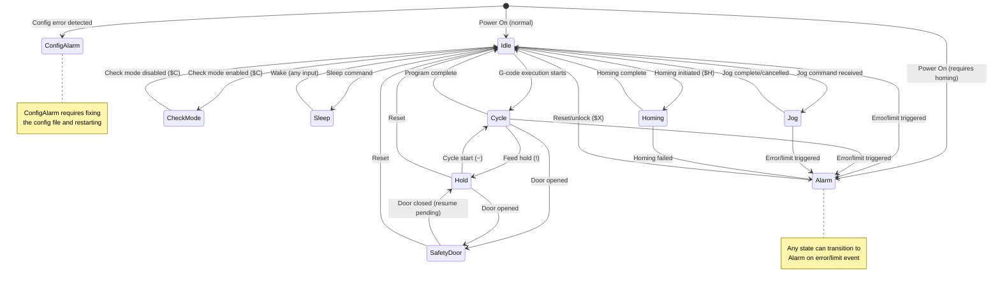

# FluidNC State Machine Diagram

This document describes the FluidNC state machine that controls the CNC controller's operating modes. This is separate from the Maslow-specific calibration states documented in `state-diagram.md`.

## State Definitions

| State | ID | Description |
|-------|-----|-------------|
| **Idle** | 0 | Default resting state. System is ready to accept commands. |
| **Alarm** | 1 | Error/alarm condition. Locks out G-code processes. Allows settings access. |
| **CheckMode** | 2 | G-code check mode. Parses G-code without motion (dry run). |
| **Homing** | 3 | Performing homing cycle to establish machine position. |
| **Cycle** | 4 | G-code cycle is running. Motions are being executed. |
| **Hold** | 5 | Active feed hold. Motion paused, can be resumed. |
| **Jog** | 6 | Jogging mode. Manual movement commands active. |
| **SafetyDoor** | 7 | Safety door is ajar. Feed holds and de-energizes system. |
| **Sleep** | 8 | Sleep/power save state. |
| **ConfigAlarm** | 9 | Configuration error. Must fix config file before operation. |

## State Transition Diagram



## Transition Rules

### Entry Conditions

| Target State | Can Enter From | Condition |
|--------------|----------------|-----------|
| **Idle** | Cycle, Jog, Homing, Hold, CheckMode, Sleep, Alarm, SafetyDoor | When operation completes or reset |
| **Alarm** | Any state (except ConfigAlarm) | Error or limit switch triggered |
| **CheckMode** | Idle | $C command (toggle) |
| **Homing** | Idle | $H command |
| **Cycle** | Idle, Hold | G-code execution or cycle start |
| **Hold** | Cycle | Feed hold command (!) |
| **Jog** | Idle | Jog command ($J=...) |
| **SafetyDoor** | Cycle, Hold | Safety door opened |
| **Sleep** | Idle | Sleep command ($SLP) |
| **ConfigAlarm** | Boot | Configuration file error |

### Motion States

The following states involve active motion:
- **Cycle** - G-code execution
- **Jog** - Manual jogging
- **Homing** - Homing sequence

### Hold/Pause States

The following states are pause/hold states:
- **Hold** - Feed hold (motion can resume)
- **SafetyDoor** - Safety door open (motion suspended)

### Error States

The following states indicate errors:
- **Alarm** - Recoverable with reset ($X)
- **ConfigAlarm** - Requires config fix and restart

## Typical Workflows

### Normal Startup
```
Power On → Idle (if homing not required)
Power On → Alarm → Homing ($H) → Idle (if homing required)
```

### G-code Execution
```
Idle → Cycle (start program) → Idle (program complete)
```

### G-code with Feed Hold
```
Idle → Cycle → Hold (!) → Cycle (~) → Idle
```

### Jogging
```
Idle → Jog → Idle (jog complete)
```

### Safety Door
```
Cycle → SafetyDoor (door open) → Hold (door closed) → Cycle (~)
```

### Error Recovery
```
Any State → Alarm (error) → Idle ($X reset)
```

## Source Code Reference

The state machine is implemented in:
- State definitions: `FluidNC/src/Types.h`
- System state management: `FluidNC/src/System.h`
- Protocol and transitions: `FluidNC/src/Protocol.cpp`
- Homing: `FluidNC/src/Machine/Homing.cpp`
- Jog execution: `FluidNC/src/Jog.cpp`

## Related Diagrams

- **Maslow State Machine**: See `state-diagram.md` for the Maslow-specific calibration states (RETRACTING, RETRACTED, EXTENDING, etc.)
