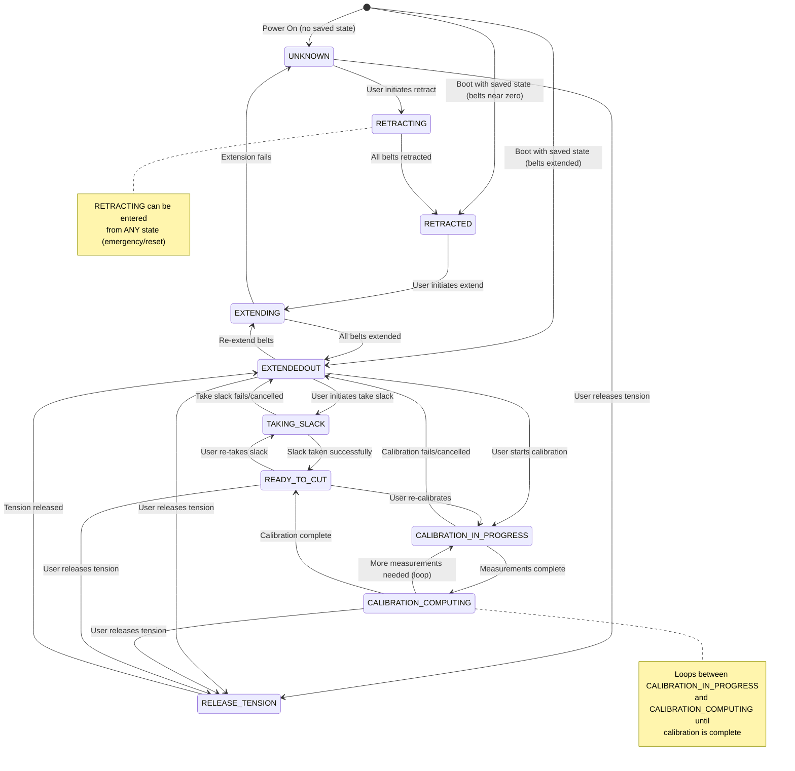

# Maslow State Machine Diagram

This document describes the state machine that controls the Maslow CNC machine's operating modes. The state machine manages belt operations, calibration, and cutting readiness.

## State Definitions

| State | ID | Description |
|-------|-----|-------------|
| **UNKNOWN** | 0 | Initial/reset state. Machine state is not determined. |
| **RETRACTING** | 1 | Belts are being retracted (pulled in). |
| **RETRACTED** | 2 | All belts are fully retracted and tight. |
| **EXTENDING** | 3 | Belts are being extended (let out). |
| **EXTENDEDOUT** | 4 | All belts are fully extended. |
| **TAKING_SLACK** | 5 | Slack is being taken up from the belts. |
| **CALIBRATION_IN_PROGRESS** | 6 | Machine is actively running calibration. |
| **READY_TO_CUT** | 7 | Machine is calibrated and ready to cut. |
| **RELEASE_TENSION** | 8 | Belt tension is being released. |
| **CALIBRATION_COMPUTING** | 9 | Computing calibration results. |

## State Transition Diagram



## Transition Rules

### Entry Conditions

| Target State | Can Enter From | Condition |
|--------------|----------------|-----------|
| **UNKNOWN** | Any state | Always allowed (reset) |
| **RETRACTING** | Any state | Always allowed (emergency retract) |
| **RETRACTED** | RETRACTING, Boot | When all belts have retracted, or boot with saved positions near zero |
| **EXTENDING** | RETRACTED, EXTENDEDOUT | User command to extend/re-extend |
| **EXTENDEDOUT** | EXTENDING, TAKING_SLACK, RELEASE_TENSION, Boot | When operation completes, or boot with saved positions extended |
| **TAKING_SLACK** | EXTENDEDOUT, READY_TO_CUT | User command |
| **CALIBRATION_IN_PROGRESS** | EXTENDEDOUT, READY_TO_CUT, CALIBRATION_COMPUTING | User command or continuing calibration |
| **READY_TO_CUT** | CALIBRATION_IN_PROGRESS, CALIBRATION_COMPUTING, TAKING_SLACK | When operation completes successfully |
| **RELEASE_TENSION** | READY_TO_CUT, UNKNOWN, EXTENDEDOUT, CALIBRATION_COMPUTING | User command |
| **CALIBRATION_COMPUTING** | CALIBRATION_IN_PROGRESS | When all measurements are taken |

> **Note:** The RETRACTING state can be entered from ANY state, providing an emergency or reset mechanism. This is not shown in the diagram to keep it readable, but is represented in the note on the diagram.

### Special Cases

1. **Boot Restoration from Saved State**: When the machine boots with valid saved belt positions in NVS (Non-Volatile Storage), the state machine can directly enter one of two states:
   - **RETRACTED**: If all saved belt positions are near zero (within 0.5mm threshold, defined in `loadBeltPositions()`)
   - **EXTENDEDOUT**: If any saved belt position is beyond the retracted threshold

   This bypasses the normal `UNKNOWN` state and allows the machine to resume operation more quickly. From `EXTENDEDOUT`, the user must initiate "Take Slack" (which enters the `TAKING_SLACK` state) to progress to `READY_TO_CUT`.

2. **Global Retract**: The `RETRACTING` state can be entered from any state, providing an emergency or reset mechanism.

3. **Global Reset**: The `UNKNOWN` state can be entered from any stable state.

## Typical Workflows

### Boot State Restoration (from saved positions)
The machine can boot directly into one of two states based on saved belt positions:
```
[Boot with saved state, belts near zero] → RETRACTED
[Boot with saved state, belts extended] → EXTENDEDOUT → TAKING_SLACK → READY_TO_CUT
```

### Initial Setup (First Use)
```
UNKNOWN → RETRACTING → RETRACTED → EXTENDING → EXTENDEDOUT → TAKING_SLACK → READY_TO_CUT
```

### Calibration Flow
The calibration process loops between `CALIBRATION_IN_PROGRESS` and `CALIBRATION_COMPUTING` until calibration is complete:
```
EXTENDEDOUT → CALIBRATION_IN_PROGRESS ↔ CALIBRATION_COMPUTING → READY_TO_CUT
                        ↑________________________↓
                           (loop until complete)
```
The typical flow is:
1. `EXTENDEDOUT` → `CALIBRATION_IN_PROGRESS` (user starts calibration)
2. `CALIBRATION_IN_PROGRESS` → `CALIBRATION_COMPUTING` (measurements taken)
3. `CALIBRATION_COMPUTING` → `CALIBRATION_IN_PROGRESS` (more measurements needed - **loops back**)
4. Repeat steps 2-3 until calibration is satisfied
5. `CALIBRATION_COMPUTING` → `READY_TO_CUT` (calibration complete)

### Re-calibration from Ready State
```
READY_TO_CUT → CALIBRATION_IN_PROGRESS → CALIBRATION_COMPUTING → READY_TO_CUT
```

### Storing the Machine
```
READY_TO_CUT → RETRACTING → RETRACTED
```

## Source Code Reference

The state machine is implemented in:
- State definitions: `FluidNC/src/Maslow/Calibration.h`
- State transitions: `FluidNC/src/Maslow/Calibration.cpp` (see `requestStateChange()`)
- Boot restoration: `FluidNC/src/Maslow/Maslow.cpp` (see `loadBeltPositions()`)

## Generating Diagram Images

The state diagram is available in multiple formats:

### Source Files
- `docs/state-diagram.md` - Markdown documentation with embedded Mermaid diagram
- `docs/state-diagram.dot` - Graphviz DOT format
- `docs/state-diagram.diag` - blockdiag format

### Generate Images

Use the build-docs script to generate SVG, PNG, and PDF versions:

```bash
# Install graphviz first:
# Ubuntu/Debian: apt-get install graphviz
# macOS: brew install graphviz
# Windows: choco install graphviz

# Generate diagrams (outputs to docs/diagrams/)
python3 build-docs.py

# Use graphviz only (recommended, more stable)
python3 build-docs.py --graphviz-only

# Use blockdiag only (requires: pip install blockdiag[pdf])
python3 build-docs.py --blockdiag-only

# Custom output directory
python3 build-docs.py --output-dir my-output
```

### Manual Generation with Graphviz

```bash
cd docs
dot -Tsvg state-diagram.dot -o state-diagram.svg
dot -Tpng state-diagram.dot -o state-diagram.png
dot -Tpdf state-diagram.dot -o state-diagram.pdf
```

### Manual Generation with blockdiag

```bash
pip install blockdiag[pdf]
cd docs
blockdiag -Tsvg state-diagram.diag -o state-diagram.svg
blockdiag -Tpng state-diagram.diag -o state-diagram.png
blockdiag -Tpdf state-diagram.diag -o state-diagram.pdf
```

> **Note:** blockdiag may have compatibility issues with Pillow >= 10.0. If you encounter errors, use graphviz instead.
