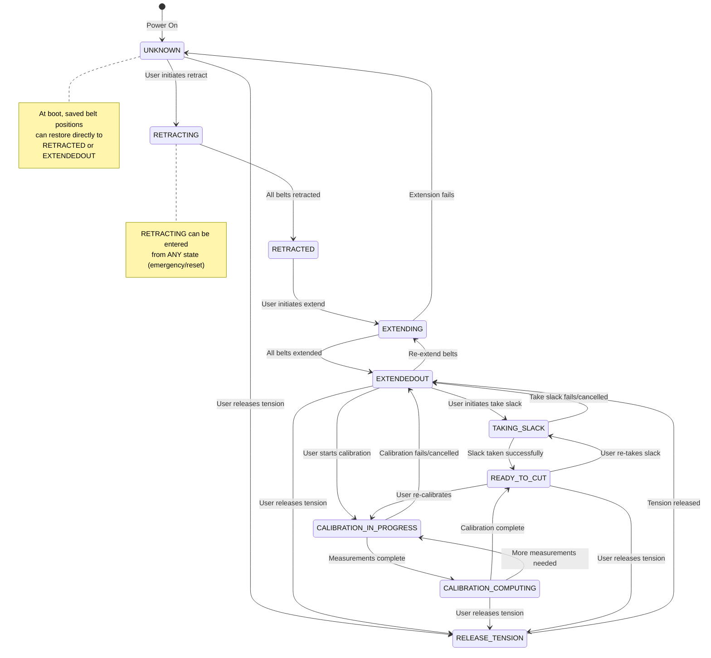

# Maslow State Machine Diagram

This document describes the state machine that controls the Maslow CNC machine's operating modes. The state machine manages belt operations, calibration, and cutting readiness.

## State Definitions

| State | ID | Description |
|-------|-----|-------------|
| **UNKNOWN** | 0 | Initial/reset state. Machine state is not determined. |
| **RETRACTING** | 1 | Belts are being retracted (pulled in). |
| **RETRACTED** | 2 | All belts are fully retracted and tight. |
| **EXTENDING** | 3 | Belts are being extended (let out). |
| **EXTENDEDOUT** | 4 | All belts are fully extended. |
| **TAKING_SLACK** | 5 | Slack is being taken up from the belts. |
| **CALIBRATION_IN_PROGRESS** | 6 | Machine is actively running calibration. |
| **READY_TO_CUT** | 7 | Machine is calibrated and ready to cut. |
| **RELEASE_TENSION** | 8 | Belt tension is being released. |
| **CALIBRATION_COMPUTING** | 9 | Computing calibration results. |

## State Transition Diagram



## Transition Rules

### Entry Conditions

| Target State | Can Enter From | Condition |
|--------------|----------------|-----------|
| **UNKNOWN** | Any state | Always allowed (reset) |
| **RETRACTING** | Any state | Always allowed (emergency retract) |
| **RETRACTED** | RETRACTING | When all belts have retracted |
| **EXTENDING** | RETRACTED, EXTENDEDOUT | User command to extend/re-extend |
| **EXTENDEDOUT** | EXTENDING, TAKING_SLACK, RELEASE_TENSION | When operation completes |
| **TAKING_SLACK** | EXTENDEDOUT, READY_TO_CUT | User command |
| **CALIBRATION_IN_PROGRESS** | EXTENDEDOUT, READY_TO_CUT, CALIBRATION_COMPUTING | User command or continuing calibration |
| **READY_TO_CUT** | CALIBRATION_IN_PROGRESS, CALIBRATION_COMPUTING, TAKING_SLACK | When operation completes successfully |
| **RELEASE_TENSION** | READY_TO_CUT, UNKNOWN, EXTENDEDOUT, CALIBRATION_COMPUTING | User command |
| **CALIBRATION_COMPUTING** | CALIBRATION_IN_PROGRESS | When all measurements are taken |

> **Note:** The RETRACTING state can be entered from ANY state, providing an emergency or reset mechanism. This is not shown in the diagram to keep it readable, but is represented in the note on the diagram.

### Special Cases

1. **Boot Restoration**: When the machine boots, saved belt positions from NVS (Non-Volatile Storage) can directly set the state to either `RETRACTED` or `EXTENDEDOUT`, bypassing the normal state machine transitions.

2. **Global Retract**: The `RETRACTING` state can be entered from any state, providing an emergency or reset mechanism.

3. **Global Reset**: The `UNKNOWN` state can be entered from any stable state.

## Typical Workflows

### Initial Setup (First Use)
```
UNKNOWN → RETRACTING → RETRACTED → EXTENDING → EXTENDEDOUT → TAKING_SLACK → READY_TO_CUT
```

### Calibration Flow
```
EXTENDEDOUT → CALIBRATION_IN_PROGRESS → CALIBRATION_COMPUTING → READY_TO_CUT
```
or if recalibration is needed:
```
CALIBRATION_IN_PROGRESS → CALIBRATION_COMPUTING → CALIBRATION_IN_PROGRESS → ... → READY_TO_CUT
```

### Re-calibration from Ready State
```
READY_TO_CUT → CALIBRATION_IN_PROGRESS → CALIBRATION_COMPUTING → READY_TO_CUT
```

### Storing the Machine
```
READY_TO_CUT → RETRACTING → RETRACTED
```

### Resuming After Power Off (with saved positions)
```
[Boot] → EXTENDEDOUT (restored from NVS)
```

## Source Code Reference

The state machine is implemented in:
- State definitions: `FluidNC/src/Maslow/Calibration.h`
- State transitions: `FluidNC/src/Maslow/Calibration.cpp` (see `requestStateChange()`)
- Boot restoration: `FluidNC/src/Maslow/Maslow.cpp` (see `loadBeltPositions()`)
